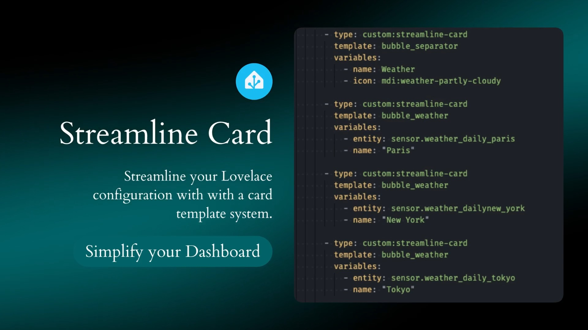

# Streamline Card



Streamline your Lovelace configuration with with a card template system.

This card is for [Lovelace](https://www.home-assistant.io/lovelace) on [Home Assistant](https://www.home-assistant.io/).

We all use multiple times the same block of configuration across our lovelace configuration and we don't want to change the same things in a hundred places across our configuration each time we want to modify something.

`streamline-card` to the rescue! This card allows you to reuse multiple times the same configuration in your lovelace configuration to avoid repetition and supports variables and default values.

`streamline-card` is an adaptation of `decluttering-card` by [@brunosabot](https://github.com/brunosabot) which is not maintained anymore.

## Installation

### With HACS (Recommended)

This method allows you to get updates directly on the HACS main page

1. If HACS is not installed yet, download it following the instructions on [https://hacs.xyz/docs/setup/download](https://hacs.xyz/docs/setup/download/)
2. Proceed to the HACS initial configuration following the instructions on [https://hacs.xyz/docs/configuration/basic](https://hacs.xyz/docs/configuration/basic)
3. On your sidebar go to `HACS` > `Frontend`
4. Click on the `+` button at the bottom right corner
5. Now search for `Streamline Card` and then click on the button at the bottom right corner to download it
6. Go back on your dashboard and click on the icon at the right top corner then on `Edit dashboard`
7. You can now click on `Add card` in the bottom right corner and search for `Streamline Card`

If it's not working, try to clear your browser cache.

### Without HACS

1. Download these files: [streamline-card.js](https://raw.githubusercontent.com/brunosabot/streamline-card/main/dist/streamline-card.js)
2. Add these files to your `<config>/www` folder
3. On your dashboard click on the icon at the right top corner then on `Edit dashboard`
4. Click again on that icon and then click on `Manage resources`
5. Click on `Add resource`
6. Copy and paste this: `/local/streamline-card.js?v=1`
7. Click on `JavaScript Module` then `Create`
8. Go back and refresh your page
9. You can now click on `Add card` in the bottom right corner and search for `streamline Card`
10. After any update of the file you will have to edit `/local/streamline-card.js?v=1` and change the version to any higher number

If it's not working, just try to clear your browser cache.`

## Configuration

### Defining your templates

First, you need to define your templates.

The templates are defined in an object at the root of your lovelace configuration. This object needs to be named `streamline_templates`.

This object needs to contains your templates declaration, each template has a name and can contain variables. A variable needs to be enclosed in double square brackets `[[variable_name]]`. It will later be replaced by a real value when you instantiate a card which uses this template. If a variable is alone on it's line, enclose it in single quotes: `'[[variable_name]]'`.

You can also define default values for your variables in the `default` object.

For a card:

```yaml
streamline_templates:
  <template_name>
    default:  # This is optional
      - <variable_name>: <variable_value>
      - <variable_name>: <variable_value>
      [...]
    card:  # This is where you put your card config (it can be a card embedding other cards)
      type: custom:my-super-card
      [...]
```

For a Picture-Element:

```yaml
streamline_templates:
  <template_name>
    default:  # This is optional
      - <variable_name>: <variable_value>
      - <variable_name>: <variable_value>
      [...]
    element:  # This is where you put your element config
      type: icon
      [...]
```

Example in your `lovelace-ui.yaml`:

```yaml
resources:
  - url: /local/streamline-card.js
    type: module

streamline_templates:
  my_first_template: # This is the name of a template
    default:
      - icon: fire
    card:
      type: custom:button-card
      name: "[[name]]"
      icon: "mdi:[[icon]]"

  my_second_template: # This is the name of another template
    card:
      type: custom:vertical-stack-in-card
      cards:
        - type: horizontal-stack
          cards:
            - type: custom:button-card
              entity: "[[entity_1]]"
            - type: custom:button-card
              entity: "[[entity_2]]"
```

### Using the card

| Name      | Type   | Requirement  | Description                                                    |
| --------- | ------ | ------------ | -------------------------------------------------------------- |
| type      | string | **Required** | `custom:streamline-card`                                       |
| template  | object | **Required** | The template to use from `streamline_templates`                |
| variables | list   | **Optional** | List of variables and their value to replace in the `template` |

Example which references the previous templates:

```yaml
- type: custom:streamline-card
  template: my_first_template
  variables:
    - name: Test Button
    - icon: arrow-up

- type: custom:streamline-card
  template: my_first_template
  variables: Default Icon Button

- type: custom:streamline-card
  template: my_second_template
  variables:
    - entity_1: switch.my_switch
    - entity_2: light.my_light
```
