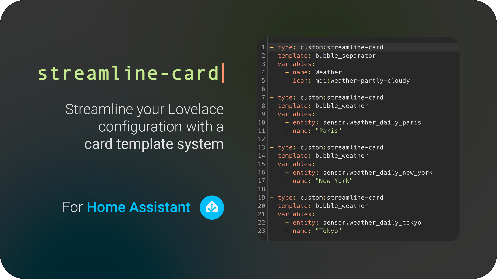

# Streamline Card



Streamline your Lovelace configuration with a powerful card template system.

This card is for [Lovelace](https://www.home-assistant.io/lovelace) on [Home Assistant](https://www.home-assistant.io/).

## What is This Card?

Have you ever found yourself copying and pasting the same card configuration over and over in your Home Assistant dashboard? For example, you might have multiple light cards that all look the same, just with different entities. Every time you want to change how these cards look, you have to change each one individually. This is time-consuming and prone to errors.

This is where `streamline-card` comes to help! It allows you to:

1. Create a template for your cards once
2. Reuse that template multiple times
3. Only change the template in one place to update all cards using it
4. Use variables to customize each instance of the template
5. Use JavaScript to make your cards dynamic and smart

`streamline-card` is an adaptation by [@brunosabot](https://github.com/brunosabot) of `decluttering-card` which is not maintained anymore.

## Installation

There are two ways to install this card. The recommended way is through HACS (Home Assistant Community Store), but you can also install it manually.

### With HACS (Recommended)

HACS is like an app store for Home Assistant. It makes installing and updating custom cards much easier. Here's how to install using HACS:

1. **Install HACS if you don't have it:**

   - If HACS is not installed yet, download it following the instructions on [https://hacs.xyz/docs/use/download/download/](https://hacs.xyz/docs/use/download/download/)
   - Follow the HACS initial configuration guide at [https://hacs.xyz/docs/configuration/basic](https://hacs.xyz/docs/configuration/basic)

2. **Add the Repository:**

   - Go to `HACS` in your Home Assistant sidebar
   - Click the three dots button (⋮) at the top right corner
   - Click `Custom repositories`
   - In the form that appears:
     - Put `https://github.com/brunosabot/streamline-card` as the repository
     - Select `Dashboard` as the type
     - Click `Add`

3. **Install the Card:**

   - Search for `Streamline Card` in HACS
   - Click on the card when you find it
   - Click the `Download` button at the bottom right

4. **Add to Your Dashboard:**
   - Go back to your dashboard
   - Click the menu icon (⋮) at the top right corner
   - Click `Edit dashboard`
   - Click `Add card` at the bottom right
   - Search for `Streamline Card`

If you don't see the card, try clearing your browser cache.

### Manual Installation

If you prefer to install manually or can't use HACS, follow these steps:

1. **Download the Card:**
   - Download this file: [streamline-card.js](https://raw.githubusercontent.com/brunosabot/streamline-card/main/dist/streamline-card.js)
   - Save it to your Home Assistant `<config>/www` folder
2. **Add to Resources:**

   - Go to your dashboard
   - Click the menu icon (⋮) at the top right
   - Click `Edit dashboard`
   - Click the menu icon again
   - Click `Manage resources`
   - Click `Add resource`
   - Enter `/local/streamline-card.js?v=1` in the URL field
   - Select `JavaScript Module`
   - Click `Create`

3. **Add to Dashboard:**
   - Refresh your browser page
   - Edit your dashboard
   - Click `Add card`
   - Search for `Streamline Card`

Note: After updating the file, you'll need to change the version number in the URL (e.g., from `v=1` to `v=2`) to make sure your browser loads the new version.

## Configuration

Let's learn how to use this card step by step.

### Step 1: Understanding Templates

A template is like a blueprint for your cards. It defines how your card will look and behave, but leaves certain parts (variables) empty so you can fill them in later.

For example, let's say you want to create a template for a light card. The template might look like this:

```yaml
my_light_template:
  card:
    type: custom:bubble-card
    name: "[[room_name]] Light" # This will be filled in later
    icon: "[[light_icon]]" # This will be filled in later
    entity: "[[light_entity]]" # This will be filled in later
```

### Step 2: Setting Up Templates

There are two ways to set up your templates: through YAML files or through the UI. Let's look at both methods:

#### Method 1: YAML Configuration (Recommended for Many Templates)

1. **Create a Templates Directory:**
   Create a folder called `streamline_templates` in your Home Assistant configuration directory.

2. **Add Template Files:**
   In this folder, create YAML files for your templates. For example, `light_template.yaml`:

   ```yaml
   default:
     - light_icon: mdi:ceiling-light
   card:
     type: custom:bubble-card
     name: "[[room_name]] Light"
     icon: "[[light_icon]]"
     entity: "[[light_entity]]"
   ```

3. **Include Templates in Dashboard:**
   In your dashboard configuration file, add:
   ```yaml
   streamline_templates: !include_dir_named ../streamline_templates/
   ```

---

##### ⚡️ Automatic Template File Loading and Fallback Locations

> **Note:** An example template file, `streamline_templates.example.yaml`, is provided in the `dist/` directory of this repository. You can copy this file to any of the supported locations (such as `/hacsfiles/streamline-card/`, `/local/streamline-card/`, or `/local/community/streamline-card/`) and rename it to `streamline_templates.yaml` to get started quickly with your own templates.

The `streamline-card` will automatically attempt to load the `streamline_templates.yaml` file from several locations, in the following order:

1. `/hacsfiles/streamline-card/streamline_templates.yaml` (default for HACS installations)
2. `/local/streamline-card/streamline_templates.yaml` (commonly used for manual installations)
3. `/local/community/streamline-card/streamline_templates.yaml` (used by some community setups)

If the file is not found in the first location, the card will try the next, and so on. This fallback mechanism ensures maximum compatibility with different Home Assistant setups.

**What does this mean for you?**
- You can place your `streamline_templates.yaml` file in any of these locations, depending on how you installed the card and your Home Assistant directory structure.
- Only one file is needed; the card will use the first one it finds.
- This makes it easy to provide or override templates without modifying the card code.

---

#### Method 2: UI Configuration (Easier for Beginners)

1. **Open Raw Editor:**

   - Go to your dashboard
   - Click the menu icon (⋮)
   - Click `Raw configuration editor`

2. **Add Templates:**
   At the top of the file, add:
   ```yaml
   streamline_templates:
     my_light_template:
       default:
         - light_icon: mdi:ceiling-light
       card:
         type: custom:bubble-card
         name: "[[room_name]] Light"
         icon: "[[light_icon]]"
         entity: "[[light_entity]]"
   ```

### Step 3: Template Structure

Each template has three main parts:

1. **Template Name:**
   This is how you'll refer to your template later.

   ```yaml
   my_light_template: # This is the template name
   ```

2. **Default Values (Optional):**
   These are values that will be used if not specified when using the template.

   ```yaml
   default:
     - light_icon: mdi:ceiling-light
   ```

3. **Card Configuration:**
   This is the actual card configuration, with variables in double brackets.

   ```yaml
   card: # Use 'card' for normal cards
     type: custom:bubble-card
     name: "[[room_name]] Light"
     icon: "[[light_icon]]"
     entity: "[[light_entity]]"

   # OR

   element: # Use 'element' for picture-elements
     type: icon
     icon: "[[icon]]"
   ```

### Step 4: Using Variables

Variables are placeholders in your template that get replaced with actual values when you use the template. They are written with double brackets: `[[variable_name]]`

Some important rules about variables:

- Always put them in double brackets: `[[like_this]]`
- If a variable is alone on a line, put it in single quotes: `'[[variable_name]]'`
- Variables can be used anywhere in the template
- You can set default values for variables in the `default` section

### Step 5: Advanced Features - JavaScript Expressions

You can make your templates dynamic using JavaScript. Any key that ends with `_javascript` will be evaluated as JavaScript code.
The javascript code has access to the following data

- **states**: An object containing all states
- **user**: An object containing the current user information, for instance `user.name` or `user.is_admin`
- **variables**: An object containing all the variables you've defined in your template
- **areas**: An object containing all areas defined in Home Assistant, for instance you can use `areas.kitchen.icon`

Here's an example of a dynamic weather card that changes color based on temperature:

```yaml
weather_template:
  card:
    type: custom:bubble-card
    card_type: button
    button_type: state
    entity: "[[weather_entity]]"
    styles_javascript: |
      const temp = states['[[weather_entity]]'].attributes.temperature;
      `
        .bubble-button-card-container {
          background-color: ${
            temp < 0 ? 'var(--info-color)' :
            temp > 30 ? 'var(--error-color)' :
            'var(--primary-color)'
          };
        }
      `;
```

## Real-World Examples

Let's look at some complete examples you can use in your own configuration:

### Example 1: Simple Light Card

```yaml
streamline_templates:
  light_template:
    default:
      - icon: mdi:ceiling-light
    card:
      type: custom:bubble-card
      card_type: button
      button_type: "[[type]]"
      entity: "[[entity]]"
      name: "[[name]]"
      icon: "[[icon]]"
      tap_action:
        action: toggle
      hold_action:
        action: more-info

# Using the template:
- type: custom:streamline-card
  template: light_template
  variables:
    - name: Living Room Light
    - entity: light.living_room
    - type: slider
```

### Example 2: Weather Card with Dynamic Styling

```yaml
streamline_templates:
  weather_card:
    card:
      type: custom:bubble-card
      card_type: button
      button_type: state
      entity: "[[entity]]"
      name: "[[name]]"
      show_state: true
      scrolling_effect: false
      card_layout: large
      sub_button:
        - name: Min
          icon: mdi:thermometer-low
          entity: "[[entity]]"
          attribute: forecast[0].templow
          show_background: false
          show_attribute: true
        - name: Wind
          icon: mdi:weather-windy
          entity: "[[entity]]"
          attribute: wind_speed
          show_background: false
          show_attribute: true
      card_mod:
        style: |
          .bubble-name {
              background-color: ${
                state_attr(config.entity, 'temperature') < 10 ?
                'var(--info-color)' :
                state_attr(config.entity, 'temperature') > 30 ?
                'var(--warning-color)' :
                ''
              };
          }

# Using the template:
- type: custom:streamline-card
  template: weather_card
  variables:
    - name: Current Weather
    - entity: weather.home
```

### Example 3: Alarm Card with State-Based Colors

```yaml
streamline_templates:
  alarm_template:
    default:
      - name: ''
      - columns: 2
    card:
      type: custom:bubble-card
      card_type: button
      button_type: state
      entity: "[[entity]]"
      name: "[[name]]"
      show_state: true
      icon: mdi:alarm-light
      columns: "[[columns]]"
      card_layout: large
      styles: |
        .bubble-button-card-container {
          background-color: ${
            state === 'disarmed' ? 'var(--success-color)' :
            state === 'triggered' || state ==='pending' ? 'var(--error-color)' :
            'var(--warning-color)'
          };
        }

# Using the template:
- type: custom:streamline-card
  template: alarm_template
  variables:
    - name: House Alarm
    - entity: alarm_control_panel.home_alarm
```

### Example 4: Dynamic Grid of Lights

```yaml
streamline_templates:
  lights_grid:
    default:
      - entity: sensor.number_lights_on
    card:
      type: grid
      square: false
      columns: 3
      cards_javascript: |
        const onLightEntities = states['[[entity]]'].attributes.lights_on_entity || [];

        return onLightEntities.map(entity => ({
          type: 'custom:button-card',
          template: 'light_brightness',
          entity: entity
        }));

# Using the template:
- type: custom:streamline-card
  template: lights_grid
  variables:
    - entity: sensor.active_lights
```

## 📚 Examples

Explore real-world template examples to help you get started and inspire your own creations:

- [Bubble Light Template](examples/bubble_light.md):
  - A reusable light control card with toggle, name, icon, and slider/button options. Demonstrates default values for variables.
- [Bubble Cover Template](examples/bubble_cover.md):
  - A cover (e.g., window shutter) control card showing dynamic JavaScript styling (`_javascript` suffix) and service call actions in sub-buttons.
- [Entity List Template](examples/entity_list_template.md):
  - DRY configuration for a list of similar entities, showing how to use templates and variables for scalable dashboards (Issue #51).
- [Template Objects with JavaScript](examples/template_objects.md):
  - Dynamically generate cards using JavaScript and entity attributes for advanced, data-driven dashboards (Issue #39).
- [Conditional JavaScript Styling](examples/conditional_javascript.md):
  - Use the `_javascript` suffix for dynamic styling and animations based on entity state (Issue #38).

Each example includes the YAML code, an explanation of its use, and highlights interesting implementation details.

## Tips and Best Practices

1. **Organizing Templates:**

   - Keep related templates together in the same file
   - Use clear, descriptive template names
   - Comment your templates to explain what they do

2. **Variables:**

   - Use descriptive variable names
   - Set default values for commonly used variables
   - Keep variable names consistent across related templates

3. **JavaScript Usage:**

   - Use JavaScript for dynamic content only when needed
   - Test your JavaScript expressions thoroughly
   - Keep the code simple and readable

4. **Performance:**
   - Don't overuse JavaScript expressions
   - Avoid complex calculations in templates
   - Use appropriate card types for your needs

## Troubleshooting

If you're having issues:

1. **Card Not Showing Up:**

   - Clear your browser cache
   - Check that the resource is properly loaded
   - Check your browser's console for errors

2. **Template Not Working:**

   - Verify your template syntax
   - Check that all required variables are provided
   - Look for YAML formatting errors

3. **JavaScript Errors:**
   - Check your browser's console for error messages
   - Verify that your entities exist
   - Test your JavaScript code separately

## Contributing

Found a bug? Want to add a feature? Feel free to:

1. Open an issue
2. Submit a pull request
3. Share your template examples with the community

Your contributions help make this card better for everyone!
